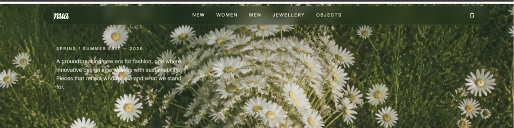

# nua Studio — E-Commerce Experience

A premium, highly considered e-commerce web application designed for **nua Studio**.

[](https://react.dev)
[](https://www.typescriptlang.org)
[](https://vitejs.dev)
[](https://sass-lang.org)
[](https://tanstack.com)

---

## Interface Preview

### Desktop Landing & Capsule Header


### Dynamic Product Details & Persistent Cart Drawer



---

## Key Features & Design Details

- **Organic Capsule Header:** A floating capsule header transitioning dynamically between translucent deep forest moss glass (`rgba(20, 37, 26, 0.45)`) and warm cream frosted glass based on scroll triggers.
- **Category Scroll Interceptors:** Interactive header anchors scroll the window smoothly to collection blocks, preserving URL hashes.
- **Deep-Linkable Variants:** Size and color selections validate against a Zod route schema and persist directly in the URL search query, allowing instant shareability.
- **Persisted Cart Drawer:** A slide-out panel utilizing React Context + `useReducer` to manage product additions, quantity limits, item removals, and totals, fully synced with local storage.
- **Resilient Mock Transactions:** Integrated simulated server functions with loading state feedback and an intentional random failure rate to demonstrate UI robustness.

---

## Tech Stack & Directory Structure

```
f:\newweb
├── docs/                     # Project screenshots & asset logs
├── public/                   # Public images & icons
└── src/
    ├── assets/               # Background imagery
    ├── components/           # Focused UI components
    │   ├── CartDrawer/       # Slide-over bag layout
    │   ├── CategorySection/  # Categorized product splits
    │   ├── Footer/           # Simplified links & subscribe newsletter
    │   ├── Hero/             # Banner layout with daisies backdrop
    │   └── Navbar/           # Organic capsule-style header
    ├── hooks/                # Mobile layout & viewport custom hooks
    ├── lib/                  # Formatters, stubs, and API services
    ├── routes/               # TanStack SSR loader-route tree
    ├── stores/               # Context-based Cart Provider
    └── styles/               # SCSS mixins and base design variables
```

---

## Getting Started

### 1. Install Dependencies

Ensure you have Node.js 18+ installed, then install dependencies:

```bash
npm install
```

### 2. Run Local Development Server

Start the local hot-reloaded development environment:

```bash
npm run dev
```

Open `http://localhost:3000` to view the website.

### 3. Production Build

Verify compilation, linting, and bundle sizes:

```bash
npm run build
```

---

## Decisions & Trade-Offs

Detailed architectural choices, including why Context API was chosen over heavier state engines and how deep-linkable parameters are structured, are documented in the root-level [DECISIONS.md](DECISIONS.md) file.
